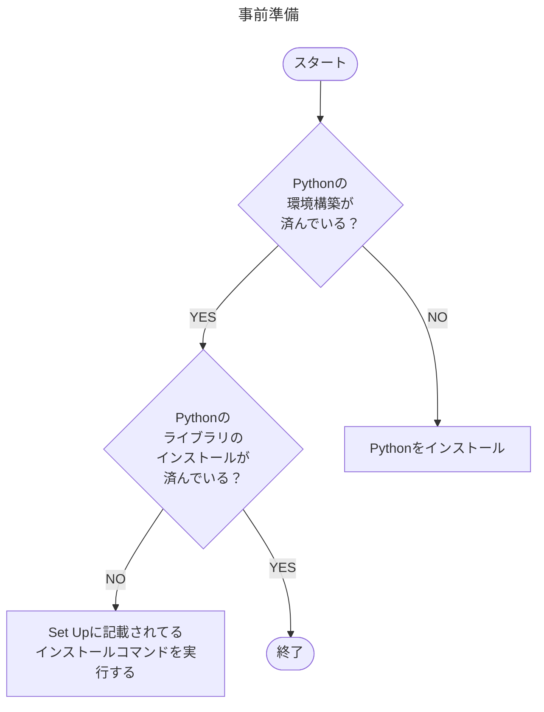
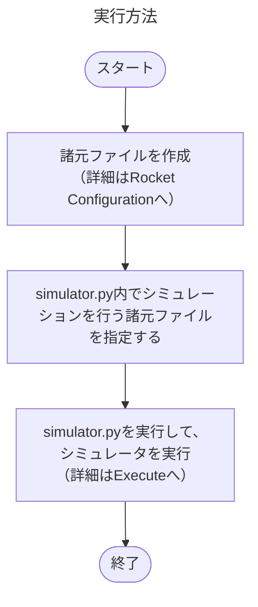

# Outline
Pythonで記述されたQuablaの簡易版

# Environment

Python 3.13</br>
encoding UTF-8


# Motivation
* 気軽にロケットの飛翔シミュレータを作ってみたい
* モデルをどこまで簡略化できるかの検証

<!-- # Agenda
* プログラム仕様 
* ファイル入力・出力規則 -->

# Usage

下記の環境構築、事前準備を行う。




上記が完了したら、下記を参考にシミュレータを実行する。


# Rocket Configuration

[サンプルケースのcsvファイル](example/rocket_config.csv)があるので、こちらを参考にロケットの諸元フィルを作成する。</br>
コピーしたものを数値だけ変更して使用することを推奨する。</br>
入力が必要な項目、値の定義などは基本的に安全審査の諸元に準している。（2025/08現在）</br>
諸元ファイルの入力項目、推力ファイルの指定方法に関する詳細は[こちら](docs/input_file.md)を参照のこと。

# Select Configuration

[`simulator.py`](simulator.py)内で、シミュレーションを行う機体諸元csvファイルを指定する。
|変数名|説明|
|--|--|
|`path_config`|機体諸元csvファイルのパスを指定する。相対パスも指定可能だが、絶対パスでの指定を推奨。|
|`path_result`|シミュレーション結果の出力先のフォルダのパス|
|`name_case`|シミレーションを行う条件のケース名。単条件計算時のみ適用される。|

# Execute

コマンドプロンプト(Win OS)やターミナル上(Mac OS)で下記のコマンドで[`simulator.py`](simulator.py)を実行する。

```
$ python simulator.py
```

落下分散を計算するかどうかは、`simulator.py`のコード中のコメントアウトで切り替える。</br>
単一条件の軌道計算のみの場合は、`run_single()`のコメントアウトを、
落下分散の計算は、`run_loop()`のコメントアウトを外す。</br>
デフォルトの設定のままだと、`test`フォルダ直下に結果が出力される。

# Set up

必要なPythonのライブラリのインストール
```
$ python -m pip install -r requirements.txt
```

# Future Work
* HTMLで結果まとめ
* ファイルの入力・出力規則
* 落下分散計算時の全条件の到達高度などの出力
* mmなどの単位系見直し
* 諸元ファイルの文字コードが異なる時のエラー処理
* 落下分散計算条件に斜角条件を含める

# Assumption
* 重力加速度:一定
* 質量変化：推力に合わせて変化
    * 一定に比べて、サンプルケースで20mぐらい変わる
* 重心変化：変化率一定