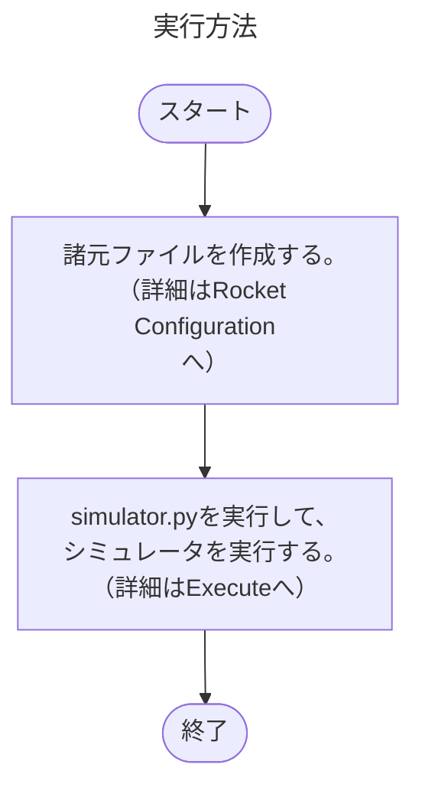

# Outline
Pythonで記述されたQuablaの簡易版

# Environment
Python 3.13

encoding UTF-8


# Motivation
* 気軽にロケットの飛翔シミュレータを作ってみたい
* モデルをどこまで簡略化できるかの検証

# Agenda
* プログラム仕様 
* ファイル入力・出力規則

# Usage

下記の環境構築、事前準備を行う。


上記が完了したら、下記を参考にシミュレータを実行する。


# Rocket Configuration

[サンプルケースのcsvファイル](example/rocket_config.csv)があるので、こちらを参考にロケットの諸元フィルを作成する。</br>
コピーしたものを数値だけ変更して使用することを推奨する。</br>
入力が必要な項目、値の定義などは基本的に安全審査の諸元に準している。（2025/08現在）
<!-- 詳細を追記する -->

# Execute

コマンドプロンプト(Win OS)やターミナル上(Mac OS)で下記のコマンドでsimulator.pyを実行する

```
$ python simulator.py
```

# Set up

必要なPythonのライブラリのインストール
```
$ python -m pip install -r requirements.txt
```

# Future Work
* HTMLで結果まとめ
* ファイルの入力・出力規則
* 落下分散計算時の全条件の到達高度などの出力
* mmなどの単位系見直し

# Assumption
* 重力加速度:一定
* 質量変化：推力に合わせて変化
    * 一定に比べて、サンプルケースで20mぐらい変わる
* 重心変化：変化率一定